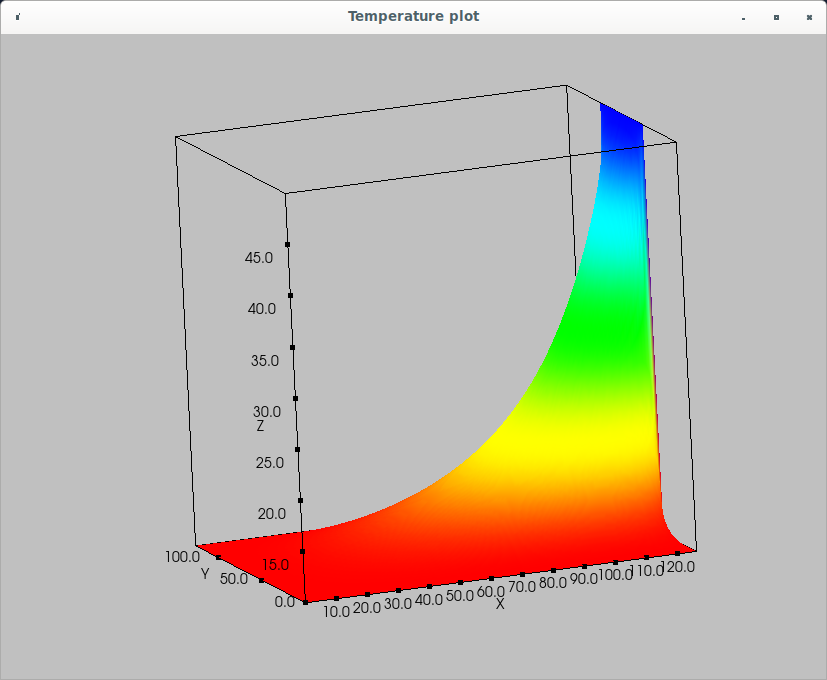

This computes the solution to Laplace's equation in a 2D rectangular
box.  The problem at hand imagines we want to compute the temperature
in a room where three walls are cooled, and the fourth, right-side wall
is also cooled to the same temp, but there is a hot doorway in the
middle of the wall.  This is an example PDE used multiple times
in the Northeastern numerical analysis class.  Students should be
familiar with the look of the solution.

This version solves Laplace's equation using the relaxation method on
finite differences.  Therefore, the method is slow -- convergence is
slow, and gets slower as the size of the grid grows.  This version 
uses CUDA to parallelize the temperature update at each point.  The
goal of this program is not to produce yet another implementation of
the relaxation method, but rather to play around with parallelizing a
simple algorithm using CUDA.

The resulting temperature distribution is displayed as a surface plot
using VTK running on the host.  Earlier versions used the Nvidia
bitmap facility to plot the result, but the VTK surface plot is much
more beautiful.

To change the simulation parameters, edit the file heateq2D_jacobi.h.
To build and run the CUDA program, do:

make
./heateq2D_jacobi

A serial version written in Matlab (*.m files) is also included in
this directory.  The Matlab version is limited in the number of points
you can use in the finite difference grid, whereas the parallelized C++
version can use a much larger grid.

Stuart Brorson, June 2022.

-------------------------------------------------------------------
Note that to run the executable, you need to provide a path to your
shared libs.  On my system I put the following into my .bashrc file:

export PATH=${PATH}:/usr/local/cuda-11.1/bin
export LD_LIBRARY_PATH=${LD_LIBRARY_PATH}:/usr/local/cuda-11.1/lib64
export LD_LIBRARY_PATH=${LD_LIBRARY_PATH}:/usr/local/src/VTK/build/lib

Your paths are probably different, but you need to specify them
somewhere to be able to run this program.

--------------------------------------------------------------------
This app uses VTK for 3D visualization of the 2D temp profile.  
To build VTK on Ubuntu 20.4:

cd /usr/local/src  # Base dir where you keep your source files
git clone https://github.com/Kitware/VTK.git
mkdir VTK/build
cd VTK/build
ccmake .. 
# This opens up a curses-based config window.  Select the build options
# you want.
make 
make install

Then, to build my Laplace solver the recommended path (recommended by
Kitware) is to use CMake.  I didn't want to fiddle around with CMake
and CUDA, so I had to experiment with my GNU Makefile to be able to
compile and link my stuff to the VTK stuff.  My solution in the
Makefile was to include links to a ton of VTK libraries.  Not pretty,
but it worked.

